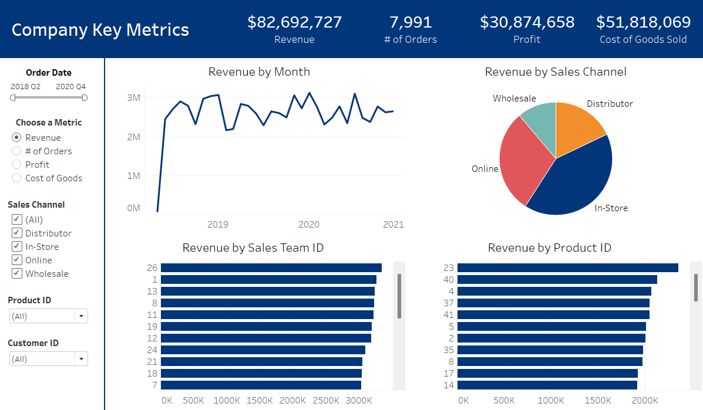

# Introduction

- This Project Explores and Analyzes Supply Chain Data for a Fictional Company
- Investigating:
  - 📈 Sales Team Performance
  - 📊 Various Sales Channels
  - 📦 Warehouse Performance
  - 🔥 Best-Selling Products
  - 🤝 Customer Relations

# The Tools I Used

- **SQL:** Running queries on the project database and revealing initial insights
- **Python:** Data Cleaning, Data Visualization, and Statistical Analysis
  - **Libraries:** Pandas, Numpy, Matplotlib
- **PostgreSQL:** Database Management
- **Tableau:** Building an Interactive Sales Dashboard
- **Visual Studio Code:** My preferred IDE for project management and executing scripts in various programming languages
- **Git & GitHub:** Version control, project tracking, and sharing my scripts + analysis

### Cleaning the Original Data

```python
# Import libraries
import pandas as pd

# Read CSV file into pandas dataframe
df = pd.read_csv(r"[file path]\csv_files\original_sales_data.csv")

# Set pandas to display all columns
pd.set_option("display.max_columns", None)

# Check dataframe for missing data
# Note: No data is missing in CSV file
missing_data = df.isnull().any()

# Check dataframe for duplicates
# Note: CSV file does not contain any duplicates
duplicates = df[df.duplicated()]

# Remove unnecessary columns
df.drop(columns=["Discount Applied", "CurrencyCode"], inplace=True)

# Rename columns for future SQL queries
modified_column_names = {
    "OrderNumber": "order_number",
    "Sales Channel": "sales_channel",
    "WarehouseCode": "warehouse_code",
    "ProcuredDate": "procured_date",
    "OrderDate": "order_date",
    "ShipDate": "ship_date",
    "DeliveryDate": "delivery_date",
    "_SalesTeamID": "sales_team_id",
    "_CustomerID": "customer_id",
    "_StoreID": "store_id",
    "_ProductID": "product_id",
    "Order Quantity": "order_quantity",
    "Unit Cost": "unit_cost",
    "Unit Price": "unit_price",
}
df.rename(columns=modified_column_names, inplace=True)

# Convert date columns to dtype: datetime with standard format YYYY-MM-DD
date_columns = ["procured_date", "order_date", "ship_date", "delivery_date"]
for column in date_columns:
    df[column] = pd.to_datetime(df[column], format="mixed", dayfirst=True)

# Convert pricing columns to dtype: float for future calculations
price_columns = ["unit_cost", "unit_price"]
for column in price_columns:
    df[column] = df[column].str.replace(r"[$,]", "", regex=True).astype(float).round(2)

# Convert ID columns from dtype: int to dtype: str
id_columns = ["sales_team_id", "customer_id", "store_id", "product_id"]
for column in id_columns:
    df[column] = df[column].astype(str)

# Calculate and display cost of each order
# Note: Will be stored as dtype: float
df["order_cost"] = (df["order_quantity"] * df["unit_cost"]).round(2)

# Calculate and display revenue from each order
# Note: Will be stored as dtype: float
df["order_revenue"] = (df["order_quantity"] * df["unit_price"]).round(2)

# Calculate and display profit from each order
# Note: Will be stored as dtype: float
df["order_profit"] = (df["order_revenue"] - df["order_cost"]).round(2)

# Write dataframe to CSV file
df.to_csv(r"[file path]\csv_files\clean_sales_data.csv", index=False)
```

### Initial SQL Queries - Questions to Answer:

1. Overall Sales Performance: What were the total sales for each sales team over the given data's timeframe?
2. Sales Performance MoM: How did each sales team perform month-over-month?
3. Sources of Revenue: Which sales channels contributed most to the company's revenue (In-Store, Online, Distributor, Wholesale)?
4. Warehouse Performance: What was the order volume handled by each warehouse, and how efficient was processing from the order date to delivery?
5. Trending Goods: What were the company's best-selling products?
6. Customer Relations: Which customers generated the highest revenue and number of orders?

# Analysis

### 1. Total Sales for Each Sales Team

#### SQL Query:

- Group data by Sales Team ID
- Calculate the sum of each order's revenue to find the total amount of sales
- Order by the total amount of sales in descending order

```sql
-- Total amount of sales for each sales team
SELECT
    sales_team_id,
    SUM(order_revenue) AS total_sales
FROM
    sales_data
GROUP BY
    sales_team_id
ORDER BY
    total_sales DESC;
```

#### Breakdown of the Results:

- **Top Sales Teams:** The top 5 sales teams in terms of total sales are teams 26, 1, 13, 8, and 11...all with totals over $3.2 million.
- **Sales Discrepancy:** There is a significant difference in total sales between the highest and lowest performing sales teams. The top sales team (Team 26) has a total that is over $1,000,000 more than the lowest sales team (Team 28).
- **Middle of the Pack:** A majority of the sales teams have totals between $2.7 and $3.3 million.
- **Overall Sales Performance:** The cumulative total sales amounts to approximately $87.2 million, indicating a strong overall performance across all teams.


_Bar graph visualizing the total amount of sales for each sales team, comparing each to the graph's average value_

### 2. Monthly Sales Performance by Sales Team ID

#### SQL Query:

- Group data by the sales team id, month, and year
- Calculate the sum of each order's revenue to find the total amount of sales for the month
- Order by the sales team id, year, and month to make results more readable

```sql
-- Sales by month for each sales team id
SELECT
    sales_team_id,
    EXTRACT(MONTH FROM order_date) AS month,
    EXTRACT(YEAR FROM order_date) AS year,
    SUM(order_revenue) AS sales
FROM
    sales_data
GROUP BY
    year,
    month,
    sales_team_id
ORDER BY
    CAST(sales_team_id AS INT),
    year,
    month;
```

#### Breakdown of the Results:

- **Overall Sales Trends:** There are fluctuations in sales volumes over time, likely influenced by seasonality, economic factors, and team performance. Notable dips and spikes may indicate specific events or strategies impacting sales.
- **Seasonality Patterns:** For many sales teams, there is an observable pattern where sales tend to increase towards the end of the year, possibly due to holiday seasons, followed by a drop at the beginning of the new year.
- **High-Performing Sales Teams:** Teams with consistently high sales over multiple months or years can be identified. Understanding what contributes to their success might be valuable for other teams. Also, teams with signigicant spikes in sales may have launched successful campaigns or promotions.
- **Underperforming Sales Teams:** Teams with consistently low sales or frequent dips may require further analysis to understand the root causes. This could be due to staffing, market conditions, or other factors.

#### Statistical Analysis:

| Sales Team ID | Mean      | Std Deviation | Variance   |
| ------------- | --------- | ------------- | ---------- |
| 1             | 105205.13 | 54894.37      | 3.0134e+09 |
| 2             | 90801.86  | 34954.17      | 1.2218e+09 |
| 3             | 94316.98  | 47533.47      | 2.2594e+09 |
| 4             | 90402.67  | 41641.02      | 1.7340e+09 |
| 5             | 89118.86  | 40672.74      | 1.6543e+09 |
| 6             | 82198.95  | 39696.13      | 1.5758e+09 |
| 7             | 97959.84  | 41221.0       | 1.6992e+09 |
| 8             | 104154.96 | 38546.38      | 1.4858e+09 |
| 9             | 96558.24  | 50989.43      | 2.5999e+09 |
| 10            | 86388.96  | 41906.5       | 1.7562e+09 |
| 11            | 103780.41 | 51403.13      | 2.6423e+09 |
| 12            | 99411.25  | 57711.99      | 3.3307e+09 |
| 13            | 104597.59 | 45366.97      | 2.0582e+09 |
| 14            | 86612.57  | 43566.08      | 1.8980e+09 |
| 15            | 96674.95  | 53800.94      | 2.8945e+09 |
| 16            | 95942.49  | 41389.63      | 1.7131e+09 |
| 17            | 88963.03  | 42508.36      | 1.8070e+09 |
| 18            | 98166.45  | 35719.22      | 1.2759e+09 |
| 19            | 102955.01 | 47872.97      | 2.2918e+09 |
| 20            | 93894.66  | 47121.04      | 2.2204e+09 |
| 21            | 95343.72  | 39443.65      | 1.5558e+09 |
| 22            | 92063.02  | 49656.77      | 2.4658e+09 |
| 23            | 93039.87  | 46604.17      | 2.1719e+09 |
| 24            | 99949.52  | 47511.02      | 2.2573e+09 |
| 25            | 90951.2   | 51670.45      | 2.6698e+09 |
| 26            | 107953.86 | 50256.74      | 2.5257e+09 |
| 27            | 81799.87  | 40029.39      | 1.6024e+09 |
| 28            | 78291.38  | 34181.64      | 1.1684e+09 |

_Table of the mean, standard deviation, and variance of the monthly sales for each sales team_

**Sales Performance:** The teams with the highest mean sales are not necessarily the most consistent. For example, Team 12 has a high mean (99,411.25), but also a high standard deviation and variance, indicating large swings in performance.

**Consistency:** Team with low standard deviations and variance (Teams 28, 2, and 18) are likely more reliable in terms of their sales output.

**Improvement Opportunities:** Teams with high variability might benefit from analysis to understand why their sales fluctuate so much. Addressing these issues could help improve consistency and overall performance.

**Targets for Intervention:** Sales teams with low mean sales and high variance may need special attention to improve their performance. Focusing on teams with high variability can also lead to more consistent outcomes for the organization.

### 3. Sales Channel Revenue

#### SQL Query:

- Group the data by sales channel
- Calculate the sum of the revenue for every order to find the total sales generated by each channel
- Order the data by the total sales values in descending order

```sql
-- Total revenue generated by each sales channel
SELECT
    sales_channel,
    ROUND(SUM(order_revenue), 2) AS total_sales
FROM
    sales_data
GROUP BY
    sales_channel
ORDER BY
    total_sales DESC;
```

#### Breakdown of the Results:

- **In-Store Sales Lead:** With sales of over $34 million, this channel is the most successful, indicating a strong customer presence and preference for in-person shopping. This might reflect a traditional retail environment, customer loyalty, or unique in-store experiences.
- **Online Sales Success:** The second-highest sales come from online shopping, totaling about $24.6 million. This shows a significant shift towards e-commerce, a common trend in many industries. It suggests that the business has a substantial digital footprint, with customers likely valuing convenience and the ability to shop from home.
- **Potential Growth Areas:** The data could hint at areas for growth or optimization. For example, increasing the online presence or expanding wholesale partnerships could be strategic. Alternatively, analyzing in-store sales to understand what drives its success could inform other channels.


_Bar graph visualizing the total amount of sales brought in by the various sales channels_


_Pie chart visualizing the distribution of sales brought in by the various sales channels as percentages_

### 4. Warehouse Performance

#### SQL Query:

- Group the data by warehouse code
- Count the rows of data to determine the number of orders
- Calculate the average processing time using the order and delivery dates

```sql
-- Average order processing time (in days) and number of orders by warehouse
SELECT
    warehouse_code,
    COUNT(*) AS num_orders,
    ROUND(AVG(delivery_date - order_date), 2) AS avg_processing_time
FROM
    sales_data
GROUP BY
    warehouse_code
ORDER BY
    avg_processing_time DESC;
```

#### Breakdown of the Results:

- **Order Distribution:** WARE-NMK1003 has the most orders (2505), while WARE-NBV1002 has the fewest (691). This reflects a substantial variance in workload across warehouses.
- **Consistency in Processing Times:** Despite differences in order volumes, the average processing times across all warehouses show relatively minor variations, with a difference of just 0.66 days between the warehouse with the longest and shortest processing times. This suggests a relatively consistent processing time despite varying workloads.


_Bar graphs visualizing the total number of orders and average processing times for each warehouse_

### 5. Best-Selling Products

#### SQL Query:

- Group the data by product id
- Calculate the sum of product quantities for each order to find the total quantity sold of each product
- Arrange the data in descending order and limit it to the first 5 results

```sql
-- Top 5 best-selling products by total quantity sold
SELECT
    product_id,
    SUM(order_quantity) AS total_quantity_sold
FROM
    sales_data
GROUP BY
    product_id
ORDER BY
    total_quantity_sold DESC
LIMIT 5;
```

#### Breakdown of the Results:

- **Product 23 Leads:** Having 956 units sold, Product 23 holds the top spot in terms of total quantity with a notable lead.
- **Strong Competition:** Products 37, 8, 4, and 40 are close in sales numbers, with 896, 879, 878, and 855 units sold, respectively.
- **Overall Range and Distribution:** The range of total quantities sold across these top 5 products isn't extremely wide, indicating that the top products are relatively well-distributed in terms of sales. The gap between the highest and the lowest is just 101 units, suggesting a competitive market.


_Bar graph visualizing the 5 best-selling products based on the total quantity sold_

### 6. Customer Relations

#### SQL Query:

- Group the data by customer id
- Count the rows of data to determine the number of orders
- Calculate the sum of the revenue for every order to find the total sales generated from each customer
- Arrange the data by total sales in descending order and limit it to the first 5 results

```sql
-- Top 5 customers by total sales and number of orders
SELECT
    customer_id,
    COUNT(*) AS num_orders,
    SUM(order_revenue) AS total_sales
FROM
    sales_data
GROUP BY
    customer_id
ORDER BY
    total_sales DESC
LIMIT 5;
```

#### Breakdown of the Results:

- **Leading the Pack:** Customer 12 leads with the most orders (210) and the highest total sales (over $2.2 million). This customer seems to be a major source of revenue, suggesting a high frequency of purchases or large order sizes.
- **Consistency in Order Count:** The number of orders for Customer 29, 17, 34, and 33 are relatively close, ranging from 156 to 179. This consistency could suggest steady purchasing behavior from these customers.
- **Potential Growth Areas:** Considering Customer 12's higher order count and total sales, there may be opportunities to explore similar patterns with other customers to increase sales. If Customer 29, 17, 34, or 33 can be encouraged to increase their order frequency or average order size, it could lead to substantial sales growth.


_Bar graph visualizing the relationships with the top 5 customers based on their number of orders and total generated revenue_

# Interactive Dashboard

### Preview


_Preview of the interactive Tableau Dashboard built for this project_

**[CLICK HERE](https://public.tableau.com/views/ComprehensiveSupplyChainAnalysis-InteractiveDashboard/CompanyKeyMetrics-Dashboard?:language=en-US&:sid=&:display_count=n&:origin=viz_share_link) TO VIEW THE COMPLETE DASHBOARD**

# Conclusion

### Insights

1. **Room to Grow:** While the data does display a strong operation within the company, there are still areas for potential improvement regarding sales team performance, sales channel optimization, and customer relations.
2. **Warehouse Workload Distribution:** Despite there being consistency in order processing times throughout the warehouses, equalizing the workload of orders being handled by each could improve work conditions and decrease customer wait times.
